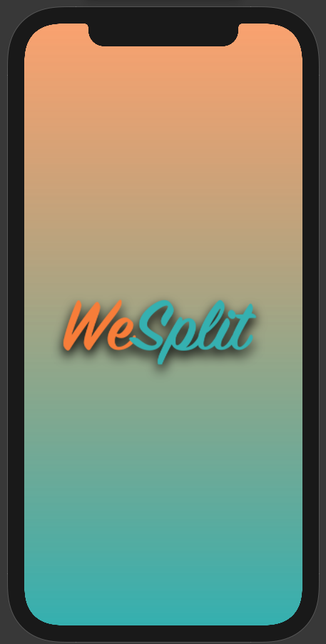
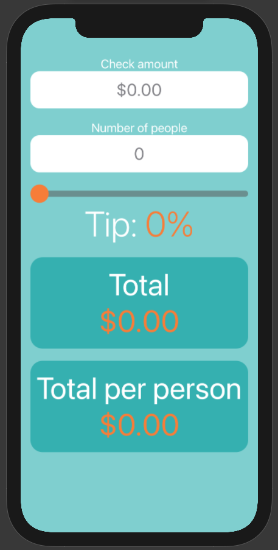
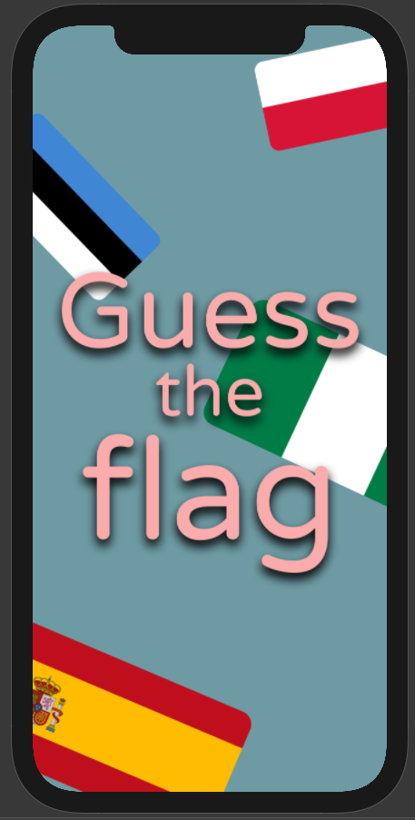
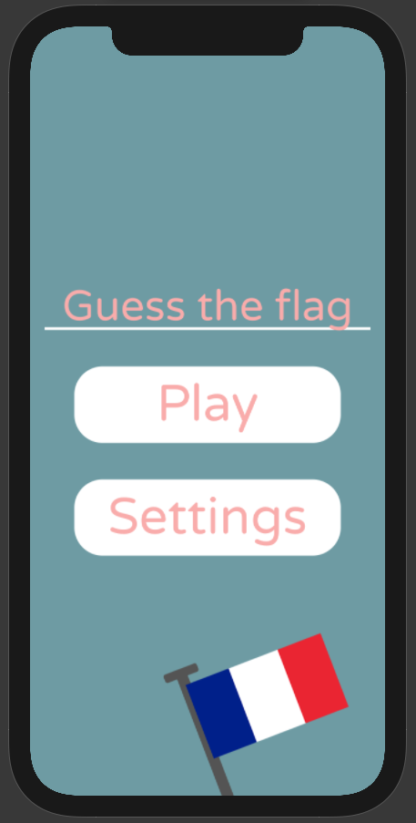
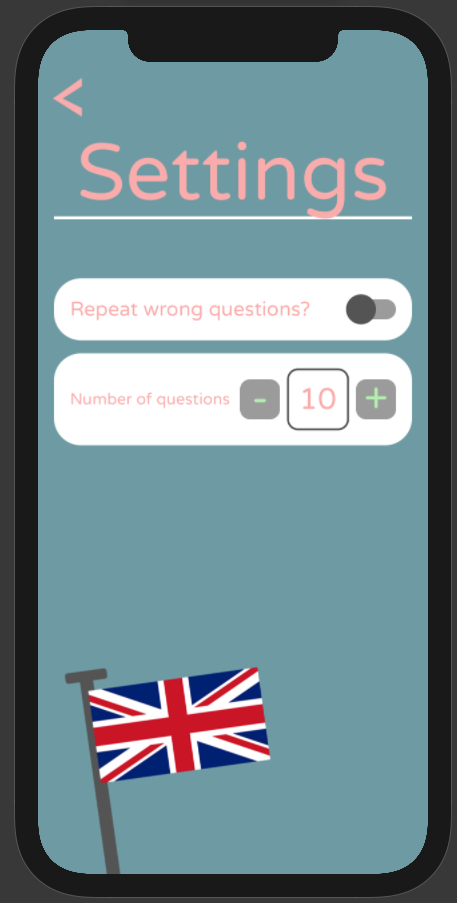
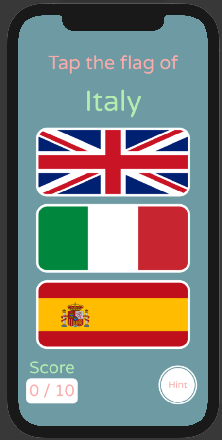
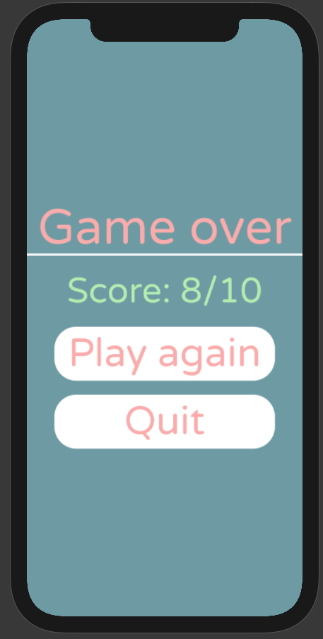
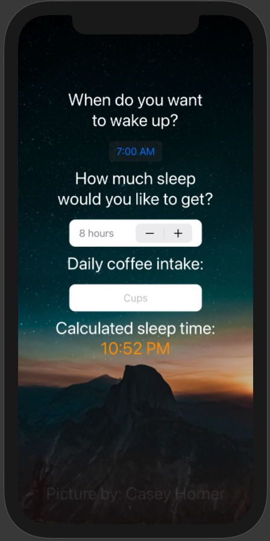

# Learning how to make Apps with swift and SwiftUI
Following tutorials from [Hacking with swift](hackingwithswift.com)

Started: 03/03/21

Completed: 12/04/21

### Completed tutorial projects
|Project               |                                                    |                                                              |                                                     |
|----------------------|----------------------------------------------------|--------------------------------------------------------------|-----------------------------------------------------|
| ✅ [Project 1 WeSplit](https://github.com/tinotusa/hacking-with-swift/tree/main/WeSplit) | |  ||
| ✅[Project 2 GuessTheFlag](https://github.com/tinotusa/hacking-with-swift/tree/main/GuessTheFlag) | |   |  |
| ✅ [Project 4 BetterRest](https://github.com/tinotusa/hacking-with-swift/tree/main/BetterRest) | |
